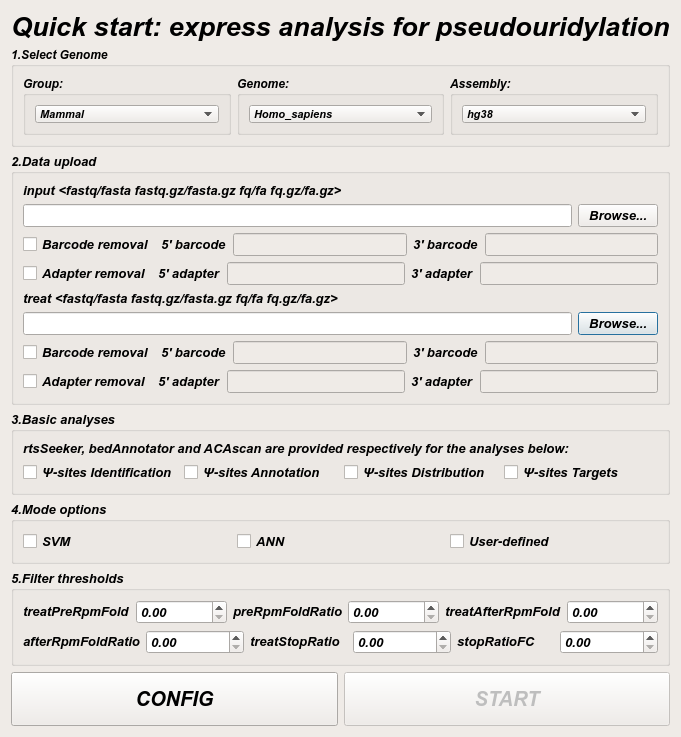
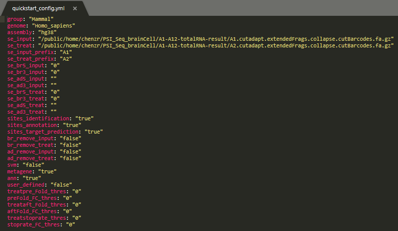

# psiFinder_snakemake

## snakemake pipline for Ψ-sites Identification/Annotation/Target

psiFinder_snakemake is a snakemake pipline (back-end code) correspond to psiFinder quick start QT widget (front-end user interface).



## Contents
- [Pre-installation](#pre-installation)
- [Input data and required files](#input-data-and-required-files)
- [Usage](#Usage)
  - [Set configuration](#set-configuration)
  - [Run psiFinder snakemake](#run-psiFinder-snakemake)

### Pre-installation
**psiFinder_snakemake** requires **snakemake/seqtk/cutadapt/STAR/bedtools/gtfToGenePred and several perl/python/R packages** pre-installation and predominantly used in unix-based operating systems. Therefore, for the usability of **psiFinder_snakemake**, we recommend running all the tools and scripts in WSL2 (WSL2 installation guide: https://pureinfotech.com/install-windows-subsystem-linux-2-windows-10/) or unix-based system with perl, python and R.

Required perl modules:
```perl
cpan Getopt::Long;
cpan Bio::Perl;
cpan Bio::SeqIO;
```

Required python modules:
```python
pip install pandas
pip install matplotlib
pip install numpy
pip install pickle
pip install scikit-learn
pip install argparse
```

Required R packages:
```R
#use pacman to install packages in batch
install.packages("pacman")
library(pacman)

#load and install required R packages 
p_load("optparse","devtools","caTools","neuralnet","NeuralNetTools","dplyr","stringr","gridExtra","cowplot","pROC","mccr","ggplot2","ggpol","ggpubr","RColorBrewer","openxlsx","reshape2","factoextra","bedr","scales","e1071","tidyr")
```

### Input data and required files
Test data and big files for the snakemake: 
- Input (CMC-control) file for Ψ-sites identification: **A1.cutadapt.extendedFrags.collapse.cutBarcodes.fa.gz** (download from: https://mega.nz/folder/oaUmhK7I#gSuYH4HW7OhL5qEbgmw0fw)
- Treat (CMC-treated) file for Ψ-sites identification: **A2.cutadapt.extendedFrags.collapse.cutBarcodes.fa.gz** (download from: https://mega.nz/folder/oaUmhK7I#gSuYH4HW7OhL5qEbgmw0fw)
- Genome files for STAR alignment: **hg38.fa**, **hg38.fa.fai** (download from https://mega.nz/folder/oaUmhK7I#gSuYH4HW7OhL5qEbgmw0fw and deposit it in  ./snakemake/genome)
- Annotation file for Ψ-sites identification: **hg38.gencode.v30.tRNA.refseqNcRNA.geneAnno.bed12** (download from https://mega.nz/folder/oaUmhK7I#gSuYH4HW7OhL5qEbgmw0fw and deposit it in  ./snakemake/script)
- Annotation file for Ψ-sites annotation: **hg38.genecode.v30.tRNA.snoRNA.miRNA.rmsk.exonFeatures.bed6** (download from https://mega.nz/folder/oaUmhK7I#gSuYH4HW7OhL5qEbgmw0fw and deposit it in  ./snakemake/script/annotation)
- Annotation file for Ψ-sites metagene: **gencode.v32.chr_patch_hapl_scaff.annotation.gtf** (download from https://mega.nz/folder/oaUmhK7I#gSuYH4HW7OhL5qEbgmw0fw and deposit it in  ./snakemake/script/metagene)

### Usage

#### Set configuration

psiFinder_snakemake require a **quickstart_config.yml** file to get user option and start the running:



Or use **psiFinder quick start QT widget** to interactively run psiFinder_snakemake:


#### Run psiFinder snakemake
```shell
bash run_psiFinder_snakemake.sh
```

> **Notice:** If **Ψ-sites Target** of **psiFinder quick start QT widget** is selected, psiFinder_snakemake will use **human_hg38_snoRNABase_snoDB_rmRepeat.collapse.fa** (ACAscan required in ./snakemake/script/target_prediction, predict H/ACA snoRNA-Ψ-target interaction, known H/ACA snoRNA sequence) and **overall_multinomialnb_model.pkl** (PUSscan required in ./snakemake/script/target_prediction, predict PUS-Ψ-target interaction, pre-built model specialized for TRUB1/PUS3/PUS1 target prediction [can be generated by psiMNB workflow: https://github.com/chenzhr23/psiMNB]).
